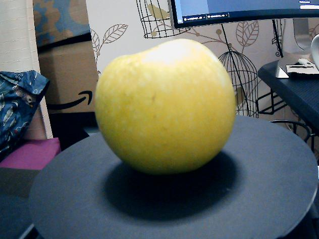
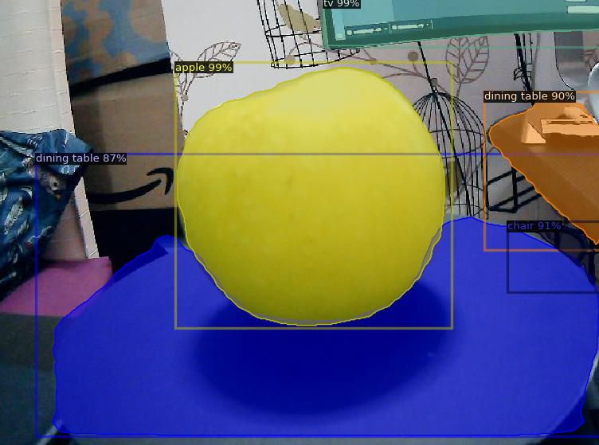

# CDT-Summer-School-2021

## Setup
* read docs to assemble and connect the hardware https://github.com/TheMemoryDealer/CDT-Summer-School-2021/blob/main/SUMMER%20SCHOOL%20Robotic%20Kit%20Instructions%20Final%20Version.pdf.

* Create a Python virtual environment
```
conda create -n detectron2 python=3.8 -y && conda activate detectron2
```

* More setup
```
pip install pyyaml==5.1 && pip install torch==1.8.0+cu101 torchvision==0.9.0+cu101 -f https://download.pytorch.org/whl/torch_stable.html && pip install detectron2 -f https://dl.fbaipublicfiles.com/detectron2/wheels/cu101/torch1.8/index.html
```

* Do this to see if torch installed correctly and cuda is enabled
``` 
python - <<EOF
import torch, torchvision
print(torch.__version__, torch.cuda.is_available())
import cv2 as cv
print(cv.__version__)
EOF
```
expected output:
```
1.7.1 True
4.5.1
```
* Running `python webcam.py` with dummy image **./input.jpg** will give give something like:
<p align="middle">
  
   
</p>
just dont forget to hit 0 to close image or you might crash the terminal sesh.

* Follow this for more help https://colab.research.google.com/drive/16jcaJoc6bCFAQ96jDe2HwtXj7BMD_-m5#scrollTo=9_FzH13EjseR

* Inference on webcam content
```
python detectron2/demo/demo.py --config-file detectron2/configs/COCO-InstanceSegmentation/mask_rcnn_R_50_FPN_3x.yaml --webcam --confidence-threshold 0.5 --opts MODEL.WEIGHTS detectron2://COCO-InstanceSegmentation/mask_rcnn_R_50_FPN_3x/137849600/model_final_f10217.pkl
```
output runs at around 7FPS on RTX 2080.
<p align="center">
  
</p>

* Quick hack to only show Apple class (pretrained system sees apple with ~97% confidence, increase the threshold to this to exclude classes with lower confidence)
```
python detectron2/demo/demo.py --config-file detectron2/configs/COCO-InstanceSegmentation/mask_rcnn_R_50_FPN_3x.yaml --webcam --confidence-threshold 0.97 --opts MODEL.WEIGHTS detectron2://COCO-InstanceSegmentation/mask_rcnn_R_50_FPN_3x/137849600/model_final_f10217.pkl
```
